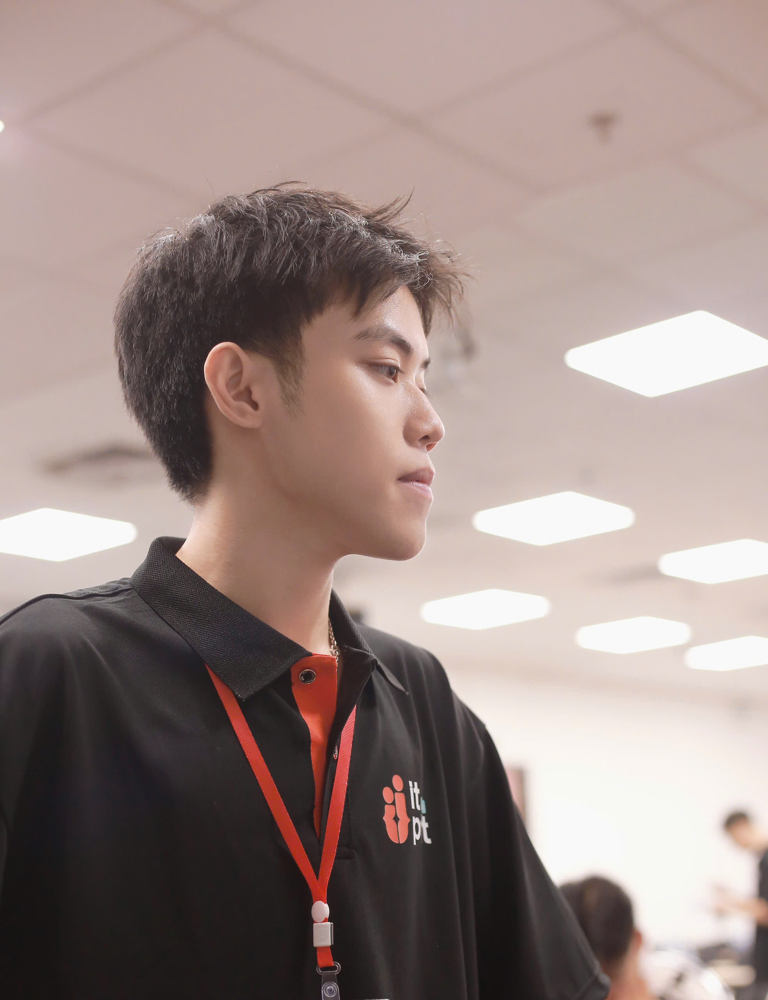

# Phuc Huwu - Computer Vision Engineer & AI Developer

  
  
  
  
  

## 👨‍💻 About Me

Computer Vision enthusiast and AI developer from Vietnam, currently pursuing Information Technology at Posts and Telecommunications Institute of Technology (PTIT). Passionate about developing AI solutions that bridge the gap between theoretical concepts and real-world applications.

### 🎯 Career Focus

-   Computer Vision Development
-   Deep Learning Implementation
-   AI Model Deployment
-   Research in AI Technologies

## 🛠️ Technical Skills

### Programming Languages

-   Python (Advanced)
-   C/C++ (Basic)

### AI & Computer Vision

-   OpenCV
-   MediaPipe
-   TensorFlow
-   PyTorch
-   RAG (Retrieval-Augmented Generation)

### Tools & Technologies

-   Git & GitHub
-   Visual Studio Code
-   Jupyter Notebook

## 🚀 Featured Projects

### 1. TuyenSinhGPT

An AI-powered system providing comprehensive information about university admissions in Vietnam.

-   **Tech Stack**: Python, RAG, SentenceTransformer, NumPy, FAISS
-   **[View Project](https://github.com/PhucHuwu/TuyenSinhGPT)**

### 2. Distance Estimation

Advanced hand-to-camera distance estimation using quadratic nonlinear regression.

-   **Tech Stack**: Python, OpenCV, MediaPipe, Matplotlib, NumPy
-   **[View Project](https://github.com/PhucHuwu/Distance_estimation)**

### 3. Vision Pointer

Innovative eye-tracking system for hands-free computer interaction.

-   **Tech Stack**: Python, OpenCV, MediaPipe
-   **[View Project](https://github.com/PhucHuwu/Vision_Pointer)**

## 🎓 Education

**Posts and Telecommunications Institute of Technology (PTIT)**

-   Bachelor of Information Technology
-   Focus on AI and Computer Vision
-   Expected Graduation: 2026

## 💼 Professional Interests

-   Computer Vision Applications
-   AI Research & Development
-   Deep Learning Innovation
-   Open Source Contribution
-   Technical Writing

## 📫 Contact Information

-   📧 Email: phuctranhuu37@gmail.com
-   📱 Phone: (+84) 368 334 223
-   📍 Location: Hoang Liet, Hoang Mai, Ha Noi, Vietnam
-   💼 GitHub: [PhucHuwu](https://github.com/PhucHuwu)
-   👥 Facebook: [Tran Huwu Phuc](https://facebook.com/Phuchuwu)

## 🗣️ Languages

-   Vietnamese (Native)
-   English (Professional Working Proficiency)

---

  <i>Let's connect and build something amazing together!</i>

